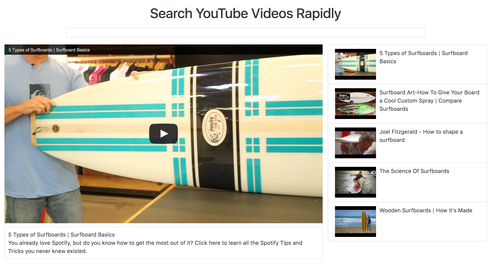

# YouTube React

This is a YouTube clone with React.js and webpack.

## Getting Started

```
git clone https://github.com/kelsonic/youtube-react.git

cd /youtube-react

npm install

npm start
```

It should not be running on [localhost:8080](http://localhost:8080).

## Purpose

Loading videos with YouTube can sometimes become slow with all of the advertisements. This app is meant to make the search process for YouTube videos much quicker.



## Credits

* [kelsonic](http://kelsonic.io)

## Contributing

1. Fork it

2. Clone your forked repo

3. Make a new branch

4. Make your edits (or add new features!)

5. Make a pull request :D

## License

MIT License. View it [here](LICENSE).